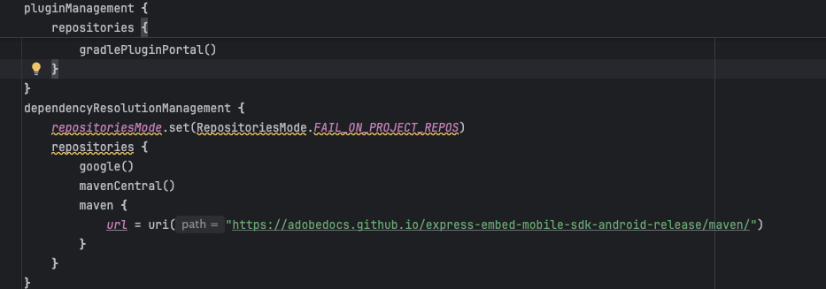
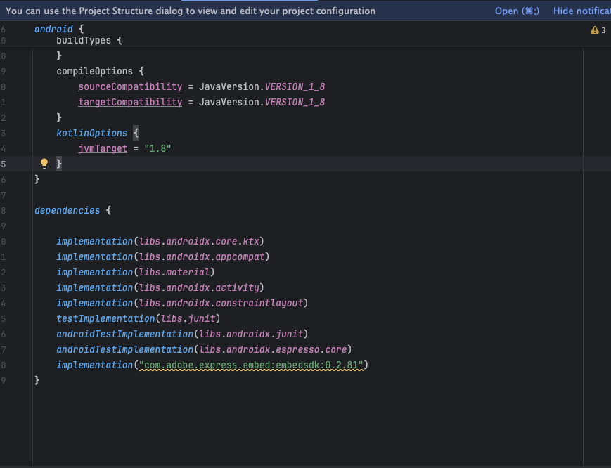

# Adobe Express Embed SDK – Android

---

## Installation Guide

Follow these steps to add the SDK to your Android project.

### 1. Add the Maven repository

Add the SDK’s Maven repository to your root project.

```groovy
dependencyResolutionManagement {
    repositories {
        google()
        mavenCentral()
        maven { url = uri("https://adobedocs.github.io/express-embed-mobile-sdk-android-release/maven/") }
    }
}
```



### 2. Add the SDK dependency

Add the latest stable Adobe Express Embed SDK release to your module’s build.gradle:

Version - Please refer to [GitHub Releases](https://github.com/AdobeDocs/express-embed-mobile-sdk-android-release/releases) to get the latest version.

```groovy
dependencies {
    implementation "com.adobe.express.embed:embedsdk:x.y.z"
}
```



That’s it — sync your project and start using the SDK

## API Documentation

For detailed information about available classes, methods, callbacks, and configuration options, please refer to the 👉 [**API Reference**](./docs/index.md).
